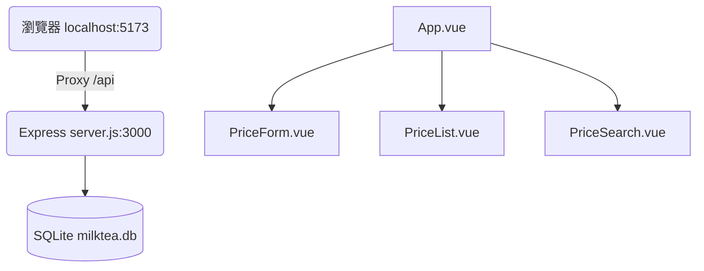

# 珍奶價格觀察站

簡介

珍奶價格觀察站是一個簡潔的單機式應用，用來記錄與觀察珍珠奶茶價格走勢。後端採用 Express 搭配 SQLite，前端採用 **Vue 3 (Vite)** 模組化架構，具備元件化設計與 SFC 組織。

**主要功能亮點**

- **Vue 3 模組化元件**：前端拆分為 `PriceForm`、`PriceList`、`PriceSearch` 等獨立元件，維護更方便。
- **日期輸入優化**：在 Vue 元件中實作 `YYYY / MM / DD` 自動跳轉與輸入限制。
- **即時搜尋與統計**：透過 Vue 的響應式狀態實現即時關鍵字篩選與資料筆數統計。
- **後端符合 OpenAPI**：API 規格儲存於 `openspec/openapi.yaml`。

安裝與啟動

先確定已安裝 Node.js（建議 v16+）。在專案根目錄執行：

### 1. 初次安裝
```bash
npm install
npm run build
```

### 2. 開發模式 (推薦)
若要進行 Vue 前端開發並享有熱更新功能，請按照以下步驟啟動：
1. **啟動後端伺服器**: 開啟終端機執行 `npm start` (伺服器將運行於 http://localhost:3000)
2. **啟動前端 UI**: 開啟另一個終端機執行 `npm run dev` (網頁將運行於 http://localhost:5173)

*註：開發模式下，前端會透過 Proxy 將 `/api` 請求轉發至 3000 埠後端。*

### 3. 正式環境啟動
編譯完成後，直接啟動伺服器即可同時提供 API 與 Vue 網頁：
```bash
npm start
```
伺服器預設在 `http://localhost:3000`。

專案架構（Vue 重構版）



- **前端目錄 (`vue/`)**：包含 Vue 3 原始碼。主要的邏輯位於 `src/App.vue` 與 `src/component/` 下。
- **後端程式 (`server.js`)**：除了提供 REST API，也會自動判斷並優先提供 `vue/dist` (如有) 或原始 `public/` 的靜態檔案。

注意事項

- **環境檢查**：
  - 子元件皆位於 `vue/src/component/` 目錄，採模組化設計。
  - 使用 SFC (Single File Components) 組織程式碼。
- **開發報錯提示**：若網頁顯示「無法載入資料」，請務必檢查是否已先啟動後端伺服器 (`npm run server`)。
- **價格排序**：根據技術決策，已移除價格排序以保持介面簡潔。

開發筆記

- 已建立完整的 OpenAPI 規格檔案：`openspec/openapi.yaml`，可用 Swagger UI 或其他工具載入檢視。
- 技術決策：已移除價格排序功能以保持界面簡潔，並專注於時間序列觀察（參見 `openspec/tasks.md` 中的決策記錄）。

